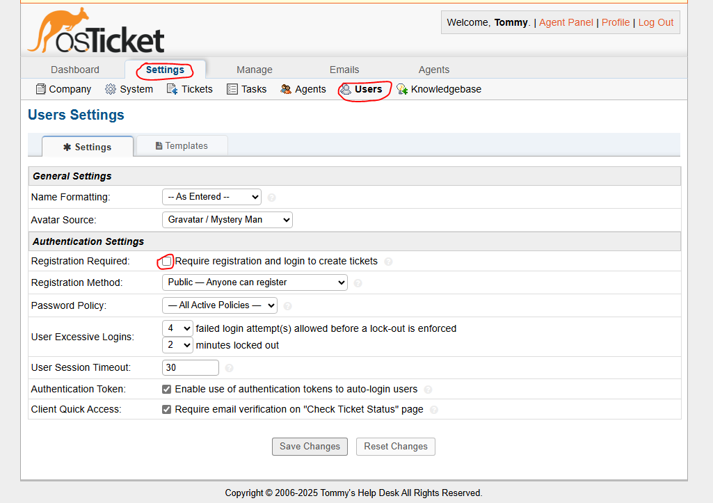
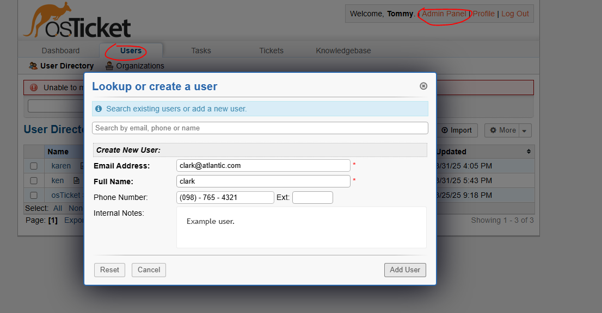

<h1>osTicket - Post-Install Configuration</h1>
This tutorial outlines the post-install configuration of the open-source help desk ticketing system osTicket. 

<h2>Environments and Technologies Used</h2>

- Microsoft Azure (Virtual Machines/Compute)
- Remote Desktop
- Internet Information Services (IIS)

<h2>Operating Systems Used </h2>

- Windows 10</b> (21H2)

<h2>Post-Install Configuration Objectives</h2>

- Item 1
- Item 2
- Item 3
- Item 4
- Item 5

<h2>Configuration Steps</h2>

  Now that osTicket is successfully installed and running, we can begin performing system administration tasks.  

  We'll start by configuring new roles within the help desk.  
  This enables effective management of user access and permissions across the system.

 

  To configure new roles within osTicket for the help desk, navigate to: 
  <strong>Admin Panel → Agents → Roles → Add New Role</strong>  

  Enter the name of the new role. In this case, I used <strong>"Supreme Admin"</strong>.  

  You can now grant permissions to this role. Since I created a Supreme Admin role, I assigned it access to <strong>all available permissions</strong>.  

  This allowed me full access to tickets and system settings — helpful for learning, testing, and administrative control.

 

  After configuring the desired roles, we will create departments.  

  Navigate to: 
  <strong>Agents → Departments → Add New Department</strong>  

  Create a new department called <strong>"SysAdmins"</strong>, which will serve as the designated department for system administrators.  

  Assign the <strong>"Supreme Admin"</strong> role to this department.  
  Make sure to set the <strong>Parent Department</strong> to <em>"Top Level Department"</em>.  

  Additional settings such as SLAs, managers, and email configurations can be customized within the Departments tab to align with your help desk's operational needs.  

  Don’t forget to click <strong>"Create Dept"</strong> after finishing the configurations.

 

  Now we will configure teams. To do so, navigate to: 
  <strong>Admin Panel → Agents → Teams</strong>  

  Creating teams allows you to group agents from different departments to collaborate more effectively.  

  For this project, create a team named <strong>"Online Banking"</strong> and assign agents from different departments as needed.

 

  In this simulated case, I wanted to allow anyone to create tickets.  

  Navigate to: 
  <strong>Admin Panel → Settings → User Settings</strong>  

  Then, uncheck the box labeled: 
  <em>"Require registration and login to create tickets"</em>  

  This allows unregistered users to submit tickets without needing an account.

 

  To configure agents (workers), navigate to: 
  <strong>Admin Panel → Agents → Add New</strong>.  

  Fill in the necessary details for each agent.  
  In my project, I created two agents: <strong>Jane Doe</strong> and <strong>John Doe</strong>.  

  I assigned Jane to the <strong>SysAdmins</strong> department and John to the <strong>Support</strong> department.  
  The Support department was a default and did not need to be created manually.  

  I granted Jane all available permissions.

 

  To create users (customers), navigate to: 
  <strong>Agent Panel → Users → Add New Users</strong>.  

  Add each user with their name and email address to enable them to submit and manage their own support tickets.

 

  To configure SLA (Service Level Agreements), navigate to: 
  <strong>Admin Panel → Manage → SLA → Add New</strong>.  

  For the names, use <strong>Sev-A</strong>, <strong>Sev-B</strong>, and <strong>Sev-C</strong>, with Sev-A being the most severe and decreasing until Sev-C.

<strong>My SLAs:</strong>

<ul>
  <li>Sev-A (Grace Period: 1 hour, Schedule: 24/7)</li>
  <li>Sev-B (Grace Period: 4 hours, Schedule: 24/7)</li>
  <li>Sev-C (Grace Period: 8 hours, Schedule: 24/5)</li>
</ul>
 

  To configure help topics for user ticket creation, navigate to: 
  <strong>Admin Panel → Manage → Help Topics → Add New Help Topic</strong>.  

  These topics will be presented to users to help them categorize their tickets effectively.  
  Support staff can be granted permission to re-categorize tickets if the customer selects an incorrect topic.

<strong>Help topics I created:</strong>

 
